# Mongo DB

### use('agencia_espacial')
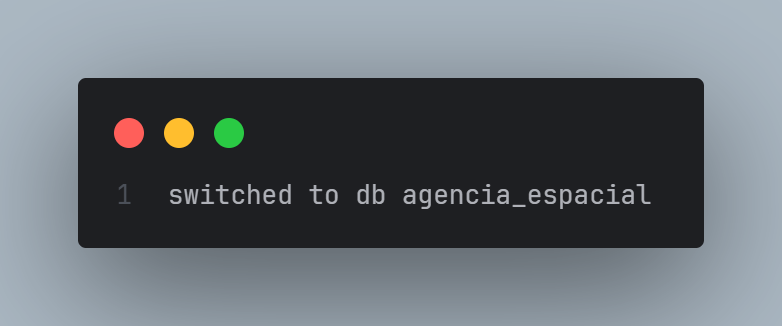

### db.alienigenas_turistas.insertMany([
    { nome: "Zlorg", planeta_origem: "Nebulon-5", especie: "Lumifero", destino: "Saturno", humor: "Animado", numero_de_tentaculos: 4, gasto_medio: 230 },
    { nome: "Xyra", planeta_origem: "Glorptar", especie: "Gelatina Sentiente", destino: "Marte", humor: "Curioso", numero_de_tentaculos: 0, gasto_medio: 180 },
    { nome: "Bliptor", planeta_origem: "Kronix", especie: "Ciborgue Etéreo", destino: "Lua", humor: "Entediado", numero_de_tentaculos: 2, gasto_medio: 90 },
    { nome: "T’quinn", planeta_origem: "Vortex-12", especie: "Anfíbio Cósmico", destino:"Terra", humor: "Fascinado", numero_de_tentaculos: 6, gasto_medio: 320 },
    { nome: "Moolah", planeta_origem: "Zeltra", especie: "Felino Galáctico", destino: "Netuno", humor: "Sonolento", numero_de_tentaculos: 3, gasto_medio: 150 }
])

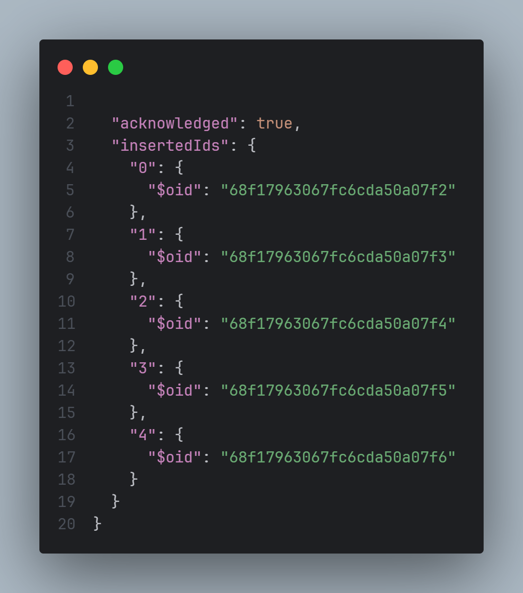

### db.alienigenas_turistas.find({destino: "Marte"})

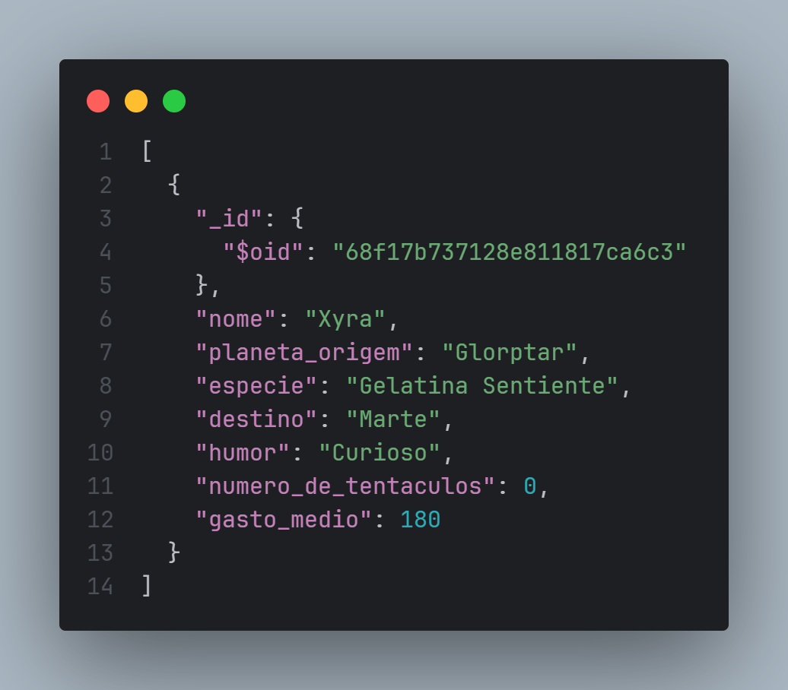

### db.alienigenas_turistas.find(
    { humor: "Animado" },
    { especie: 0, destino: 0, numero_de_tentaculos: 0, humor: 0, gasto_medio: 0, especie: 0 }
) 

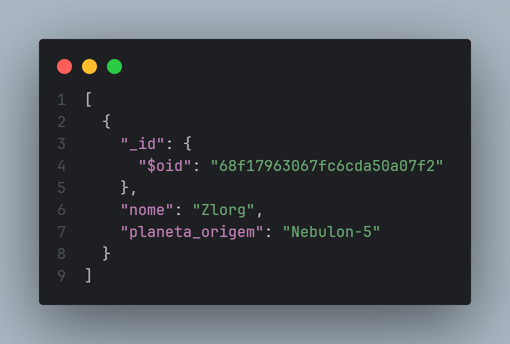

### db.alienigenas_turistas.find(
    {gasto_medio: {$gt: 200}}
)

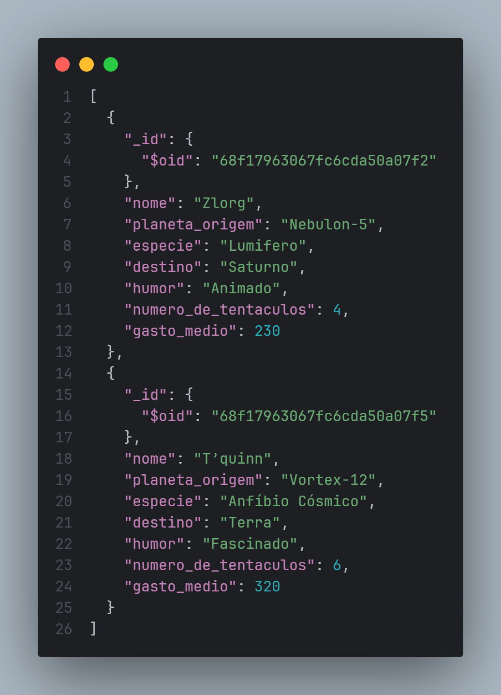

### db.alienigenas_turistas.updateOne(
    {nome: "Bliptor"},
    {$set:{humor: "Empolgado"}}
)

### db.alienigenas_turistas.updateOne(
    {nome: "T’quinn"},
    {$set:{gasto_medio: 400}}
)

### db.alienigenas_turistas.updateOne(
    {nome: "Moolah"},
    {$set:{numero_de_tentaculos: 4}}
)

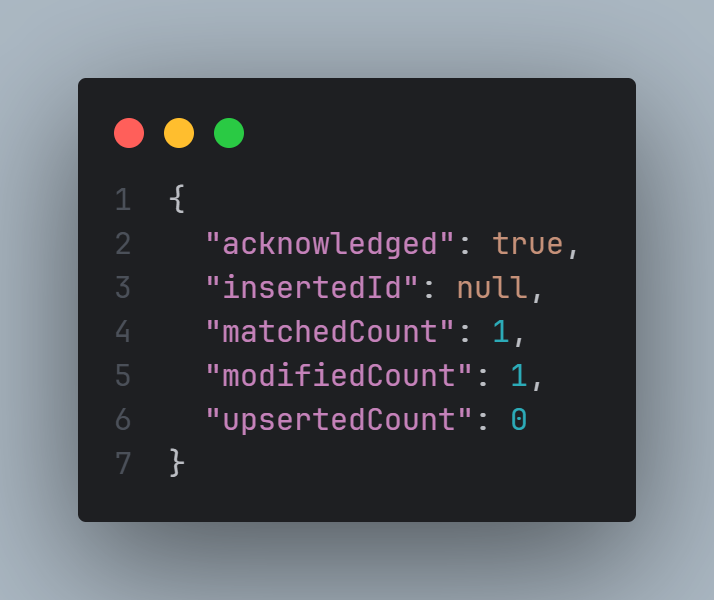

### db.alienigenas_turistas.find({numero_de_tentaculos: {$gte: 4}})

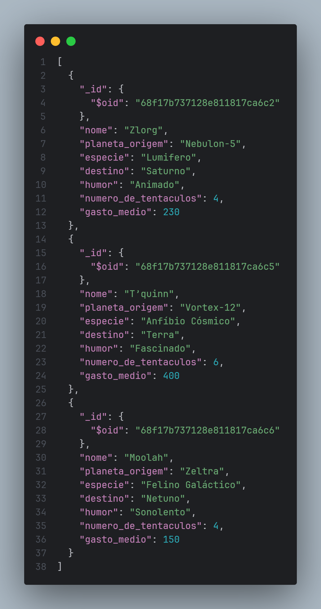

### db.alienigenas_turistas.find().sort({gasto_medio: -1}).limit(1)

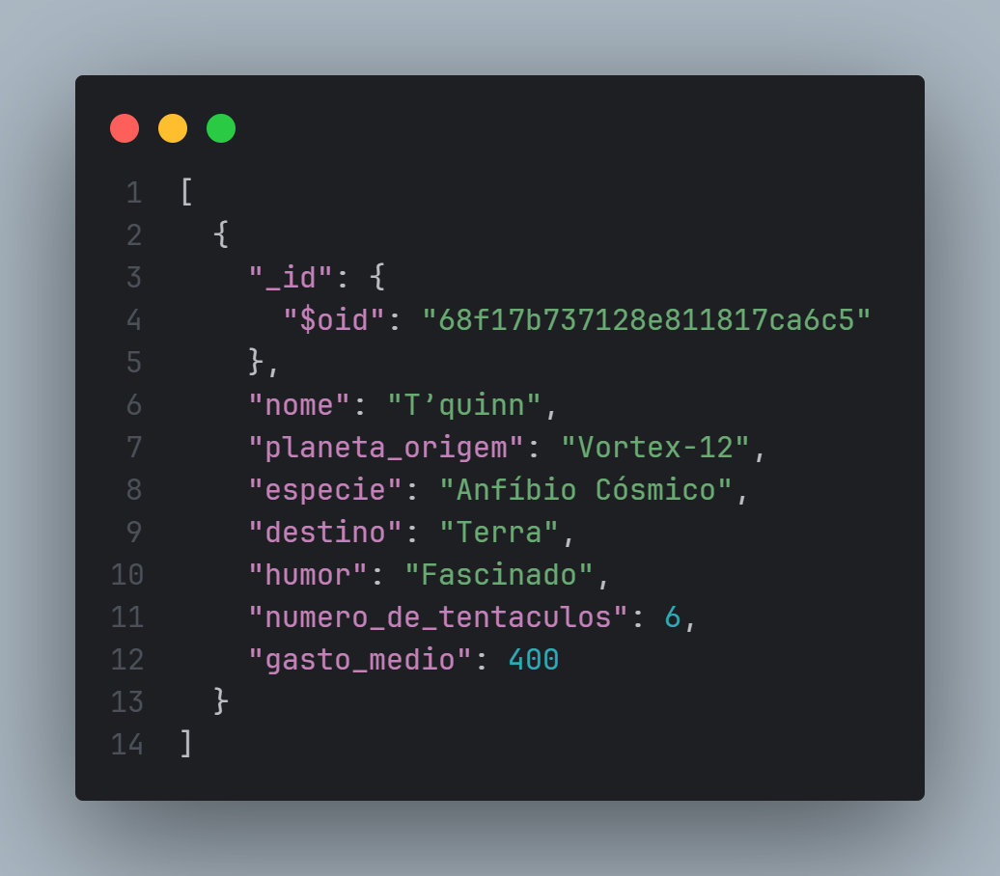

### db.alienigenas_turistas.find().sort({nome: 1})

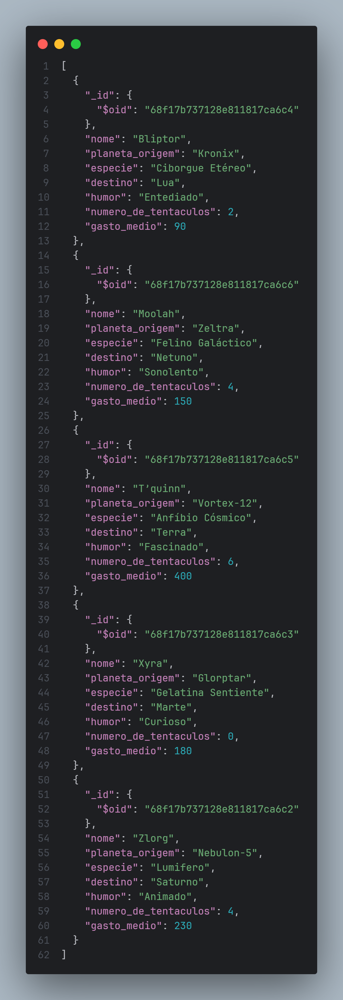

### db.naves_exploradoras.insertMany([
    {nome: "Estrela Veloz", modelo: "GX-900", comandante: "Capitã Luna", destino: "Andrômeda", tripulantes: 8, status: "Em missão", autonomia_dias: 120},
    {nome: "Aurora Nebulosa", modelo: "ZX-12", comandante: "Comandante Vork", destino: "Galáxia Sombria", tripulantes: 5, status: "Em manutenção", autonomia_dias: 80},
    {nome: "Cometa Dourado", modelo: "TX-77", comandante: "Tenente Zog", destino: "Saturno", tripulantes: 12, status: "Em missão", autonomia_dias: 150},
    {nome: "Eclipse Rubro", modelo: "RX-404", comandante: "Capitão Blork", destino: "Buraco Negro Beta", tripulantes: 3, status: "Perdida", autonomia_dias: 60},
    {nome: "Lótus Cósmica", modelo: "NX-222", comandante: "Dra. Kora", destino: "Terra", tripulantes: 10, status: "Em reparos", autonomia_dias: 100}
])

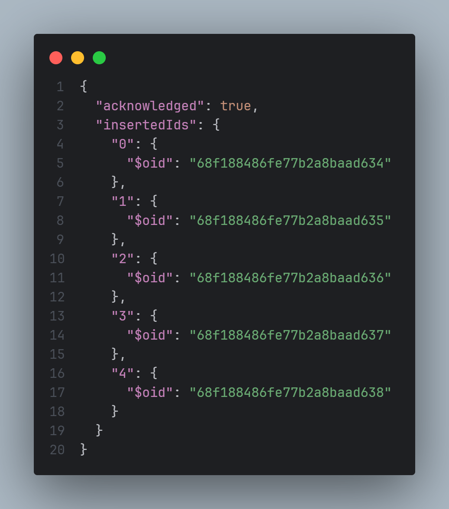

### db.naves_exploradoras.find({status: "Em missão"})

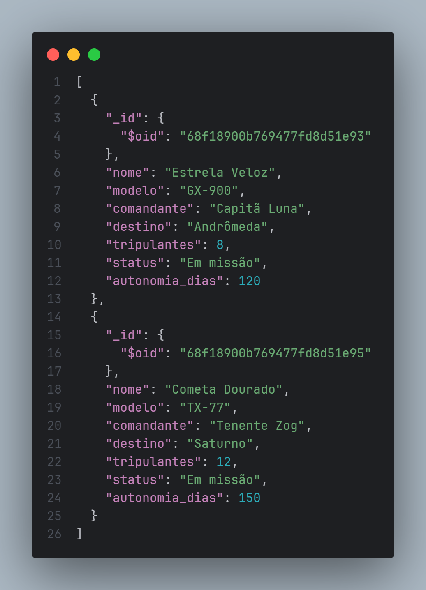

### db.naves_exploradoras.find(
    {autonomia_dias: {$gt: 100}},
    {nome:1, destino:1}
)

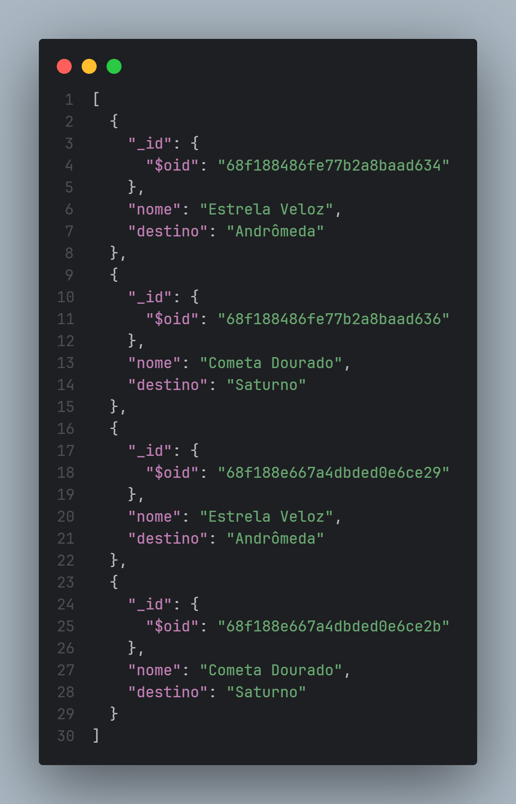

### db.naves_exploradoras.updateOne(
    {nome: "Eclipse Rubro"},
    {$set:{status: "Resgatada"}}
)

### db.naves_exploradoras.updateOne(
    {nome: "Aurora Nebulosa"},
    {$set:{autonomia_dias: 120}}
)

### db.naves_exploradoras.find().sort({tripulantes: -1})

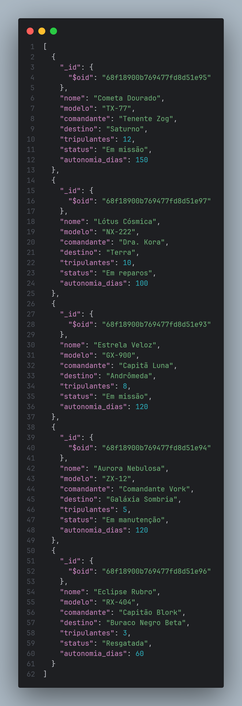

### db.robos_de_exploracao.insertMany([
    {codigo: "RBX-01 ", modelo: "RoverMax", planeta_destino: "Marte", status: "Ativo", bateria: 87, amostras_coletadas: 45},
    {codigo: "ZY-22", modelo: "GeoProbe", planeta_destino: "Europa", status: "Em reparo", bateria: 43, amostras_coletadas: 22},
    {codigo: "ALN-7", modelo: "ScanBot", planeta_destino: "Netuno", status: "Desativado", bateria: 0, amostras_coletadas: 60},
    {codigo: "GR-9 ", modelo: "DeepMiner", planeta_destino: "Vênus", status: "Ativo", bateria: 65, amostras_coletadas: 38},
    {codigo: "PX-5", modelo: "Atmoscan", planeta_destino: "Titã", status: "Ativo", bateria: 91, amostras_coletadas: 52}
])

### db.robos_de_exploracao.find({status: "Ativo"})

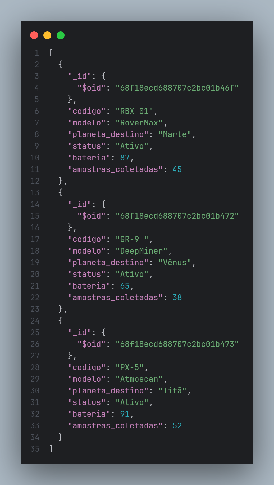

### db.robos_de_exploracao.find(
    {amostras_coletadas: {$gt: 40}},
    {codigo:1, bateria:1}
)

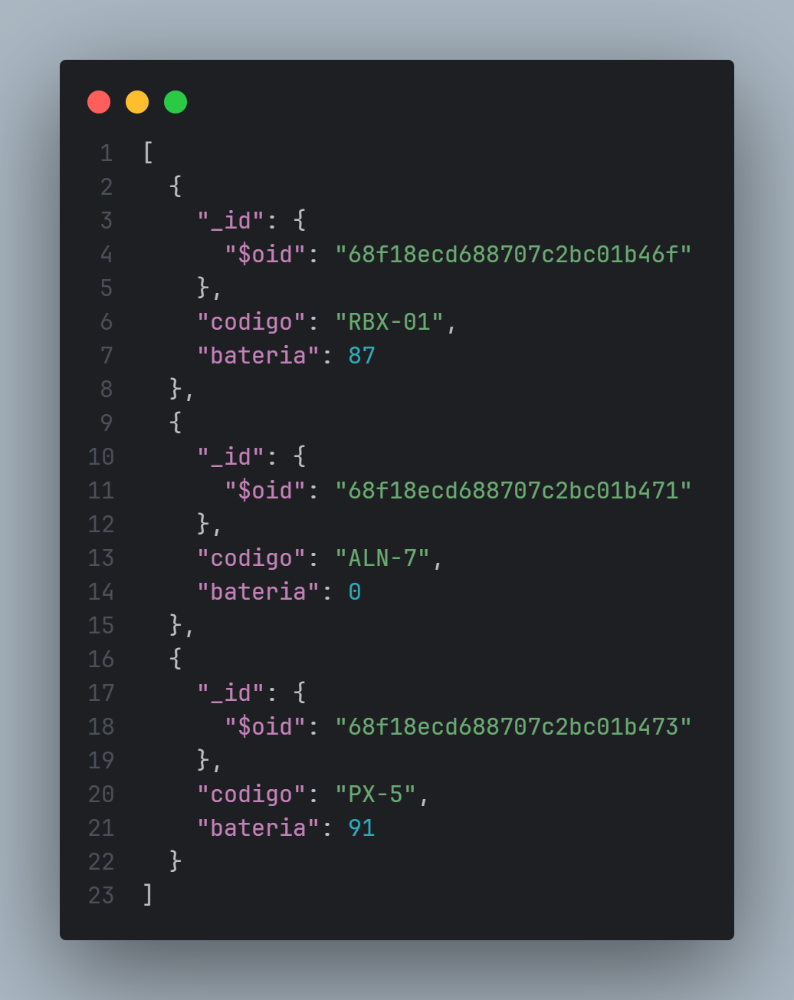

### db.robos_de_exploracao.updateOne(
    {codigo: "ZY-22"},
    {$set:{status: "Ativo"}}
)

### db.robos_de_exploracao.updateOne(
    {codigo: "ALN-7"},
    {$set:{bateria: 100}}
)

### db.robos_de_exploracao.find().sort({amostras_coletadas: -1})

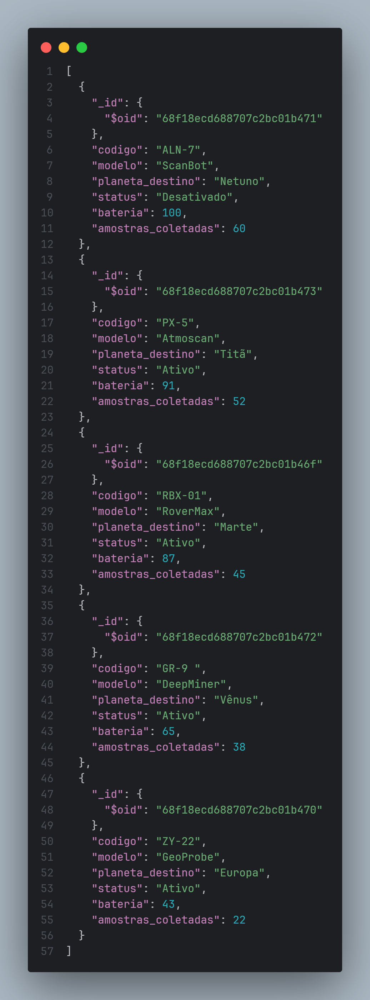

### db.planetas_catalogados.insertMany([
    {nome: "Xyphos", sistema: "Helion", tipo: "Rochoso", possui_vida: "true", gravidade: 1.1, temperatura_media: 25},
    {nome: "Glacia", sistema: "Crion", tipo: "Gelado", possui_vida: "false", gravidade: 0.8, temperatura_media: -120},
    {nome: "Voltar", sistema: "Omega-3", tipo: "Vulcânico", possui_vida: "false", gravidade: 2.3, temperatura_media: 460},
    {nome: "Aqualis", sistema: "Serpentis", tipo: "Oceânico", possui_vida: "true", gravidade: 1.0, temperatura_media: 18},
    {nome: "Drunor", sistema: "Velkar", tipo: "Gasoso", possui_vida: "false", gravidade: 0.5, temperatura_media: -60}
])

### db.planetas_catalogados.find({possui_vida: "true"})

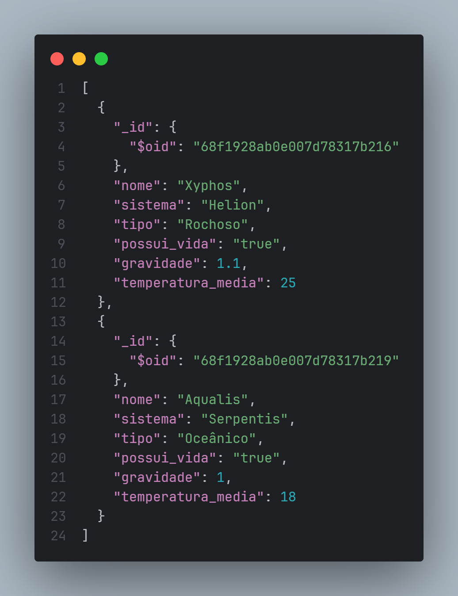

### db.planetas_catalogados.find(
    {gravidade: {$gt: 1.0}},
    {nome: 1, sistema: 1}
)

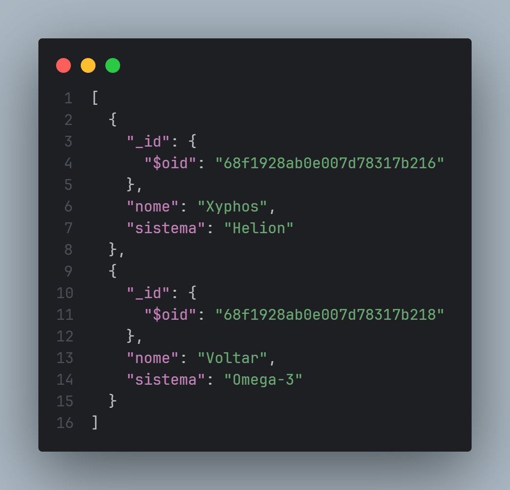

### db.planetas_catalogados.updateOne(
    {nome: "Voltar"},
    {$set:{temperatura_media: 390}}
)

### db.planetas_catalogados.updateOne(
    {nome: "Aqualis"},
    {$set:{possui_vida: "false"}}
)

### db.planetas_catalogados.find().sort({temperatura_media: 1})

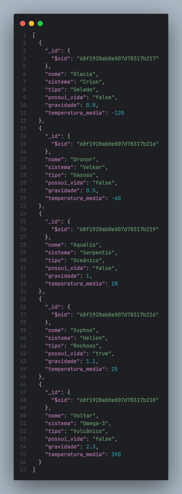

### db.eventos_cosmicos.insertMany([
    {nome_evento: "Fúria Solar Alpha", tipo: "Tempestade Estelar", localizacao: "Sistema Helion", intensidade: "Extrema", data_observacao: "2125-06-12", registrado_por: "Dr. Zark"},
    {nome_evento: "Eclipse Quântico", tipo: "Eclipse", localizacao: "Nebulosa Orion", intensidade: "Alta ", data_observacao: "2126-01-28", registrado_por: "Dra. Mira"},
    {nome_evento: "Explosão Prisma Azul", tipo: "Supernova", localizacao: "Galáxia Centauri", intensidade: "Média", data_observacao: "2125-11-04", registrado_por: "Dr. Vorn"},
    {nome_evento: "Chuva de Cristais", tipo: "Meteoro", localizacao: "Setor Z-88", intensidade: "Baixa", data_observacao: "2125-03-09", registrado_por: "Tenente Lira"},
    {nome_evento: "Buraco Branco Épsilon", tipo: "Fenômeno Quântico", localizacao: "Andrômeda", intensidade: "Extrema", data_observacao: "2124-09-22", registrado_por: "Dr. Kroh"}
])

### db.eventos_cosmicos.find({intensidade: "Extrema"})

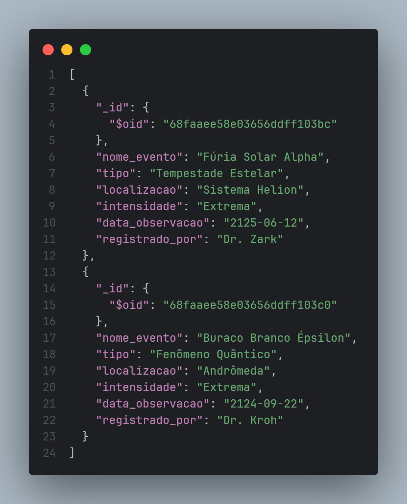

### db.eventos_cosmicos.find(
    {tipo: "Eclipse"},
    {nome_evento: 1, data_observacao: 1}
)

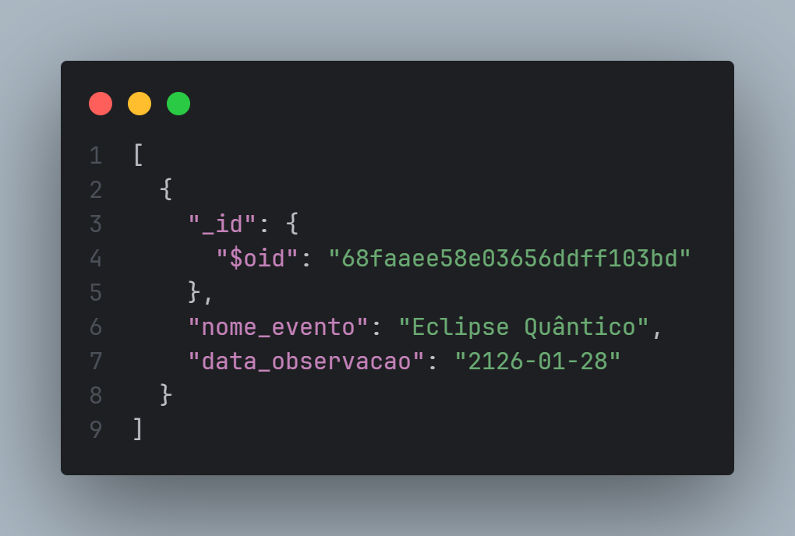

### db.eventos_cosmicos.updateOne(
    {nome_evento: "Chuva de Cristais"},
    {$set: {intensidade: "Média"}}
)

### db.eventos_cosmicos.updateOne(
    {nome_evento: "Buraco Branco Épsilon"},
    {$set: {registrado_por: "Dra. Nyra"}}
)

### db.eventos_cosmicos.find().sort({data_observacao: -1})

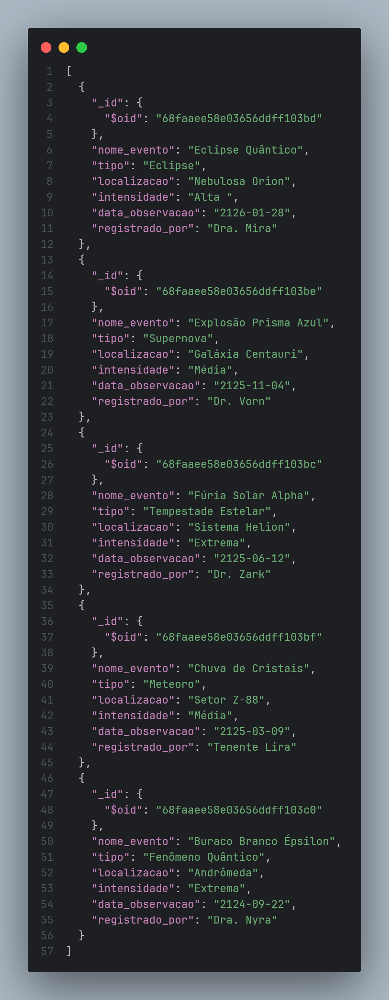